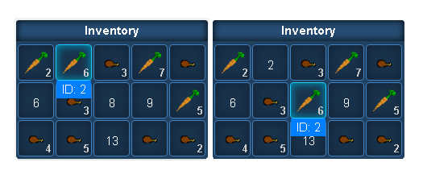

<h1 align="center">MagicBox.js</h1>
<p align="center">
  
</p>

## About
MagicBox is a jQuery-UI plugin that helps you create UI for your web-games.

### Note
*( The code may be a little bit messy at this moment, but I will do my best to make the code as clean as possible and 
also re-structure it to follow the jQuery-UI "standard" widget concept )*

### TODO List:
* **widget.Inventory**
	- [x] make panel draggable/droppable
	- [x] make panel not to colide with each other
	- [x] make items draggable/droppable
	- [x] stack items when `item.type` is equal
	- [x] switch item positions when `item.type` is not equal
	- [ ] show item stats
	- [ ] change the way of assigning icons to items (use css) 
* **widget.RPG_text**
* **widget.RPG_attributer**
* **miniTemplate.js**
	- [x] load template using Ajax
	- [x] read template and evaluate all variables

### Features
**Inventory**
* Items
  + All items are draggable/droppable
  + stats are shown, while hovering over item's icon.
  + Items of same type can be stacked, different types will just switch their positon.
* Panel
  + Panel's colision detection won't let you place panels over each other.
  + it's possible now to move around with entire inventory panel.
* General
  + Each widget has it's own template to generate the layout.

#### Example


```javascript
$('#element').inventory({
	rows: 2,
	cols: 2,
	widgets: {
		panel: {
			template: "./js/templates/inventory_panel.jst"
		},
		slot: {
			template: "./js/templates/inventory_slot.jst"
		},
		item: {
			template: "./js/templates/inventory_item.jst"
		}
	}
});
```

#### Requirements
* jQuery version >= 1.10.x
* jQuery-UI version >= 1.10.x
